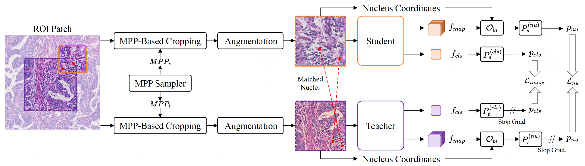

# MUSE: Multi-Scale Dense Self-Distillation for Nucleus Detection and Classification [Pre-Training]

This repo is the pre-training code of MUSE: "MUSE: Multi-Scale Dense Self-Distillation for Nucleus Detection and Classification".

<div  align="center">    

</div>

In this work, we propose **MUSE** (**MU**lti-scale den**SE** self-distillation), a novel self-supervised learning method tailored for NDC. At its core is **NuLo** (**Nu**cleus-based **Lo**cal self-distillation), a coordinate-guided mechanism that enables flexible local self-distillation based on predicted nucleus positions. By removing the need for strict spatial alignment between augmented views, NuLo allows critical cross-scale alignment, thus unlocking the capacity of models for fine-grained nucleus-level representation. To support MUSE, we design a simple yet effective encoder-decoder architecture and a large field-of-view semi-supervised fine-tuning strategy that together maximize the value of unlabeled pathology images. Extensive experiments on three widely used benchmarks demonstrate that MUSE effectively addresses the core challenges of histopathological NDC. The resulting models not only surpass state-of-the-art supervised baselines but also outperform generic pathology foundation models.

| 📖 [arXiv](https://arxiv.org/abs/2511.05170) | 🤗 [Pre-Trained Weights](https://huggingface.co/Alibaba-DAMO-Academy/MUSE) |

## News

- ✨️ **[2025-12]**: Release the pre-trained weights and evaluation code. 🚀
- ✨️ **[2025-11]**: Accepted to AAAI 2026! 🎉🎉🎉

## Quick Start

* Basic Environment

```bash
# clone this repository
git clone https://github.com/alibaba-damo-academy/MUSE.git
cd ./MUSE

# create & activate conda env
conda create --name MUSE python=3.10
conda activate MUSE

# install dependencies
pip install torch==2.2.2 torchvision==0.17.2 torchaudio==2.2.2 --index-url https://download.pytorch.org/whl/cu118

pip install -r requirements.txt
```

This codebase has been developed with Python version 3.10, PyTorch version 2.2.2, and CUDA 11.8.

* Extensions

To support the evaluation of other methods, such as CONCH, some extensions are required.

```bash
# for CONCH
pip install git+https://github.com/Mahmoodlab/CONCH.git
```

### Datasets

* Raw Datasets

Please download and unzip the [BRCAM2C](https://github.com/TopoXLab/Dataset-BRCA-M2C), [OCELOT](https://zenodo.org/records/8417503) (Version 1.0.1), and [PUMA](https://zenodo.org/records/15050523) (V5).
In addition, [TCGA](https://portal.gdc.cancer.gov/) is also required for the pre-processing of BRCAM2C and OCELOT.

For `BRCAM2C` and `OCELOT`, we use the default split of train/val/test.
For `PUMA`, we manually split the dataset into train/val/test. The split files of `PUMA` are provided in `./data/PUMA/` and should be moved to the dataset of `PUMA` before running the pre-processing (keeping the same directory structure `/PUMAFolder/split/...`).

* Pre-processing

We provide the pipeline to pre-process the raw datasets.

```bash
cd ./preprocess

# for BRCAM2C
python 01_brcam2c_restore_wsi.py --wsi_folder /path/to/TCGA --output_folder /path/to/restored/WSIs --brcam2c_patch_folder /path/to/BRCAM2C/images --tcga_meta_path /path/to/GDC_metadata.csv

python 02_brcam2c_build_eval_data.py --brcam2c_folder /path/to/BRCAM2C --wsi_folder /path/to/restored/WSIs --out_folder /path/to/BRCAM2C/eval_data

# for OCELOT
python 03_ocelot_restore_wsi.py --wsi_folder /path/to/TCGA --output_folder /path/to/restored/WSIs --ocelot_meta_path /path/to/OCELOT/matadata.json --tcga_meta_path /path/to/GDC_metadata.csv

python 04_ocelot_build_eval_data.py --ocelot_folder /path/to/OCELOT --wsi_folder /path/to/restored/WSIs --out_folder /path/to/OCELOT/eval_data

# for PUMA
python 05_puma_build_eval_data.py --puma_folder /path/to/PUMA --out_folder /path/to/PUMA/eval_data
```

By default, the pre-processed datasets should be stored in `./dataset/`. The structure is as follows:
```bash
dataset/
├── BRCAM2C
|   ├── mpp_0.5-size_224-valid_224.npy
|   ├── mpp_0.5-size_512-valid_224.npy
|   ├── mpp_0.25-size_224-valid_224.npy
|   ├── mpp_0.25-size_512-valid_224.npy
├── OCELOT
|   ├── ....
├── PUMA
|   ├── ....
```
The evaluation scripts will automatically load the pre-processed datasets from `./dataset/`.

### Pre-Trained Models

We provide the pre-trained models of MUSE at [Hugging Face](https://huggingface.co/Alibaba-DAMO-Academy/MUSE).

| Model | pre-trained weights |
| :---: | :------: |
| MUSE (ResNet-50) | [download](https://huggingface.co/Alibaba-DAMO-Academy/MUSE/resolve/main/r50-224.pth) |
| MUSE (ViT-S/16) | [download](https://huggingface.co/Alibaba-DAMO-Academy/MUSE/resolve/main/vit_s_16-224.pth) |
| MUSE (ViT-B/16) | [download](https://huggingface.co/Alibaba-DAMO-Academy/MUSE/resolve/main/vit_b_16-224.pth) |
| LFoV-MUSE (ResNet-50) | [download](https://huggingface.co/Alibaba-DAMO-Academy/MUSE/resolve/main/r50-512.pth) |
| LFoV-MUSE (ViT-S/16) | [download](https://huggingface.co/Alibaba-DAMO-Academy/MUSE/resolve/main/vit_s_16_512.pth) |
| LFoV-MUSE (ViT-B/16) | [download](https://huggingface.co/Alibaba-DAMO-Academy/MUSE/resolve/main/vit_b_16_512.pth) |

For other methods, please refer to the corresponding repositories to download the pre-trained models. For example, to reproduce the results of UNI:
1. Download the pre-trained UNI from [HF_link](https://huggingface.co/MahmoodLab/uni)
2. Change the `model_weights` in `./models/uni.py (Line 13)` to the path of the pre-trained UNI.
3. Run evaluation scripts.

Note: To evaluate CONCH, the [customized model](https://github.com/mahmoodlab/CONCH/tree/main/conch) is required. You need to download these files and copy them to `./models/conch/`

* Supported Methods

|Method|Evaluation Name|
| --- | --- |
| Supervised (ResNet-50) | sup_r50 |
| DINO (ResNet-50) | dino_r50 |
| MoCoV2, Kang et al. 2023 (ResNet-50) | kang_bench_r50 |
| DINO (ViT-S/16) | dino_vit-s-16 |
| DINO (ViT-B/16) | dino_vit-b-16 |
| MAE (ViT-B/16) | mae_vit-b |
| DINOV2 (ViT-S/14) | dinov2_vit-s |
| DINOV2 (ViT-B/14) | dinov2_vit-b |
| DINO, Kang et al. 2023 (ViT-S/16) | kang_bench_vit-s-16 |
| DINOV2, $TCGA_{nu}$ (ViT-S/16) | dinov2_vit-s-path |
| DINOV2, $TCGA_{nu}$ (ViT-B/16) | dinov2_vit-b-path |
| CHIEF (Swin-T) | chief |
| CTransPath (Swin-T) | ctrans |
| CONCH (ViT-B/16) | conch |
| UNI (ViT-L/16) | uni |
| Prov-GigaPath (ViT-G/14) | gigapath |
| MUSE (ResNet-50) | muse_r50 |
| LFoV-MUSE (ResNet-50) | lfov_muse_r50 |
| MUSE (ViT-S/16) | muse_vit-s-16 |
| MUSE (ViT-B/16) | muse_vit-b-16 |
| LFoV-MUSE (ViT-S/16) | lfov_muse_vit-s-16 |
| LFoV-MUSE (ViT-B/16) | lfov_muse_vit-b-16 |

### Customized Models

The basic structure of a customized model is as follows:
```python
# ================
# customized_model.py
# ================

from .nuclei_extractor import MultiLayerFeatureExtractorHead
# other imports

class CustomizedModel(nn.Module):

    def __init__(self, model_name):
        super().__init__()

        # init model and load weights
        model_weights = ...
        self.basic_model = ...
        self.basic_model.load_state_dict(torch.load(model_weights))

        # init the feature extractor
        self.dense_feature_extractor = MultiLayerFeatureExtractorHead()

    def forward(self, input_img, input_coords):
        input_size = input_img.shape[-1]

        # forward pass
        out = self.basic_model(input_img)
        # to feature maps, [B, C, H, W]
        out = self.dense_feature_extractor.to_feature_maps(out)

        # the input of the feature extractor:
        # 1. list of feature maps
        # 2. query coordinates (this is generated by main function)
        # 3. input image size (auto-detected from the input image)
        return self.dense_feature_extractor([out], input_coords, input_size)
```
Move the customized model to `./models/` and register it in `./models/__init__.py`, `linear_knn_eval.py`, and `finetuning_eval.py`.

The `./models/dino_vit.py` is a good example. Please refer to the `./models/dino_vit.py` for more details.

## Evaluation

### Linear Probing Evaluation

```bash
bash linear_eval.sh $METHOD $EVAL_SIZE
```
where `$METHOD` is the name of the method to evaluate, and `$EVAL_SIZE` is the FoV (224/512) of the evaluation dataset.

### KNN Evaluation

```bash
bash knn_eval.sh $METHOD $EVAL_SIZE
```
where `$METHOD` is the name of the method to evaluate, and `$EVAL_SIZE` is the FoV (224/512) of the evaluation dataset.

### Fine-Tuning Evaluation

```bash
bash ft_eval.sh $METHOD $EVAL_SIZE $FT_LR $FT_BS
```
where `$METHOD` is the name of the method to evaluate, `$EVAL_SIZE` is the FoV (224/512) of the evaluation dataset, `$FT_LR` is the learning rate of fine-tuning, and `$FT_BS` is the batch size of fine-tuning.

Note I: Fine-tuning evaluation will attempt to load the prediction heads trained in Linear Probing evaluation. Therefore, performing linear probing evaluation before fine-tuning evaluation is necessary.

Note II: The default learning rate (1e-5) and batch size (32) are suggested to be used for ViT-based models. For ResNet-based models, a larger learning rate (4e-5) is recommended.

## Results

To summarize the results of each method, you can run `python summarize_res.py --model_name $METHOD --eval_size $EVAL_SIZE`.

### KNN Evaluation

|Method|BRCAM2C (20x)|OCELOT (20x)|PUMA (20x)|BRCAM2C (40x)|OCELOT (40x)|PUMA (40x)|
| --- | --- | --- | --- | --- | --- | --- |
| Supervised (ResNet-50) | 73.29 | 72.57 | 73.57 | 74.79 | 70.61 | 73.81 |
| DINO (ResNet-50) | 76.29 | 73.00 | 74.04 | 75.37 | 70.72 | 74.06 |
| MoCoV2, Kang et al. 2023 (ResNet-50) | 79.37 | 76.83 | 74.52 | 78.23 | 78.03 | 75.48 |
| DINO (ViT-S/16) | 77.25 | 71.94 | 70.22 | 77.78 | 70.72 | 71.29 |
| DINO (ViT-B/16) | 78.03 | 73.11 | 71.40 | 76.28 | 72.30 | 72.86 |
| MAE (ViT-B/16) | 65.45 | 67.04 | 61.79 | 67.45 | 66.18 | 64.14 |
| DINOV2 (ViT-S/14) | 80.27 | 76.77 | 69.55 | 78.80 | 77.35 | 73.26 |
| DINOV2 (ViT-B/14) | 79.11 | 75.25 | 68.81 | 80.12 | 76.06 | 73.50 |
| DINO, Kang et al. 2023 (ViT-S/16) | 84.31 | 82.06 | 76.69 | 80.55 | 78.42 | 76.20 |
| DINOV2, $TCGA_{nu}$ (ViT-S/16) | 78.56 | 75.44 | 71.94 | 77.08 | 73.98 | 71.74 |
| DINOV2, $TCGA_{nu}$ (ViT-B/16) | 77.90 | 75.22 | 72.06 | 77.73 | 74.13 | 71.17 |
| CHIEF (Swin-T) | 78.39 | 80.21 | 74.17 | 75.71 | 73.76 | 73.73 |
| CTransPath (Swin-T) | 80.39 | 80.07 | 74.89 | 77.73 | 73.77 | 73.62 |
| CONCH (ViT-B/16) | 86.68 | 88.08 | 81.95 | 86.71 | 86.00 | 83.05 |
| UNI (ViT-L/16) | 87.65 | 87.35 | 82.21 | 88.82 | 85.90 | 81.95 |
| Prov-GigaPath (ViT-G/14) | 86.44 | 86.99 | 80.24 | 86.49 | 83.59 | 79.90 |
| MUSE (ResNet-50) | 88.37 | 85.51 | 81.21 | 85.78 | 83.49 | 78.60 |
| LFoV-MUSE (ResNet-50) | 89.53 | 86.21 | 82.21 | 87.44 | 85.18 | 79.88 |
| MUSE (ViT-S/16) | 86.88 | 86.13 | 80.00 | 87.67 | 85.45 | 79.71 |
| MUSE (ViT-B/16) | 87.56 | 85.90 | 81.26 | 88.11 | 85.55 | 81.19 |
| LFoV-MUSE (ViT-S/16) | 85.47 | 84.17 | 79.15 | 86.00 | 84.95 | 79.82 |
| LFoV-MUSE (ViT-B/16) | 89.03 | 87.38 | 81.11 | 88.93 | 85.52 | 83.16 |


### Linear Probing Evaluation

|Method|BRCAM2C (20x)|OCELOT (20x)|PUMA (20x)|BRCAM2C (40x)|OCELOT (40x)|PUMA (40x)|
| --- | --- | --- | --- | --- | --- | --- |
| Supervised (ResNet-50) | 72.04 | 75.38 | 76.52 | 69.86 | 73.38 | 76.72 |
| DINO (ResNet-50) | 75.91 | 78.39 | 75.14 | 72.06 | 73.23 | 76.71 |
| MoCoV2, Kang et al. 2023 (ResNet-50) | 81.90 | 79.31 | 78.92 | 80.65 | 81.46 | 79.55 |
| DINO (ViT-S/16) | 69.86 | 74.52 | 73.42 | 73.89 | 73.88 | 75.19 |
| DINO (ViT-B/16) | 77.09 | 76.83 | 76.80 | 74.59 | 76.92 | 78.43 |
| MAE (ViT-B/16) | 73.54 | 77.34 | 76.16 | 71.92 | 76.17 | 76.70 |
| DINOV2 (ViT-S/14) | 78.49 | 76.79 | 75.93 | 74.95 | 78.37 | 78.06 |
| DINOV2 (ViT-B/14) | 78.96 | 78.22 | 76.09 | 74.68 | 79.28 | 79.45 |
| DINO, Kang et al. 2023 (ViT-S/16) | 80.85 | 83.61 | 79.89 | 82.15 | 82.58 | 80.61 |
| DINOV2, $TCGA_{nu}$ (ViT-S/16) | 80.61 | 82.17 | 77.53 | 81.85 | 80.87 | 77.85 |
| DINOV2, $TCGA_{nu}$ (ViT-B/16) | 82.21 | 83.25 | 78.26 | 82.35 | 81.98 | 78.88 |
| CHIEF (Swin-T) | 78.89 | 81.88 | 76.90 | 78.05 | 78.13 | 75.49 |
| CTransPath (Swin-T) | 78.80 | 81.47 | 76.56 | 77.43 | 77.52 | 76.13 |
| CONCH (ViT-B/16) | 85.13 | 86.41 | 82.02 | 86.20 | 83.80 | 83.66 |
| UNI (ViT-L/16) | 86.99 | 86.17 | 82.37 | 88.64 | 85.72 | 83.49 |
| Prov-GigaPath (ViT-G/14) | 85.99 | 87.50 | 81.79 | 87.66 | 83.80 | 81.83 |
| MUSE (ResNet-50) | 88.14 | 85.57 | 81.53 | 87.39 | 83.65 | 80.64 |
| LFoV-MUSE (ResNet-50) | 90.18 | 86.19 | 83.85 | 88.86 | 85.78 | 82.76 |
| MUSE (ViT-S/16) | 87.79 | 85.42 | 81.34 | 89.66 | 85.20 | 80.17 |
| MUSE (ViT-B/16) | 89.60 | 85.82 | 83.29 | 88.86 | 85.57 | 82.48 |
| LFoV-MUSE (ViT-S/16) | 87.06 | 87.21 | 84.22 | 86.63 | 86.57 | 83.53 |
| LFoV-MUSE (ViT-B/16) | 89.20 | 86.10 | 84.36 | 90.18 | 86.43 | 85.12 |

### Fine-Tuning Evaluation

|Method|BRCAM2C (20x)|OCELOT (20x)|PUMA (20x)|BRCAM2C (40x)|OCELOT (40x)|PUMA (40x)|
| --- | --- | --- | --- | --- | --- | --- |
| Supervised (ResNet-50) | 72.19 | 75.49 | 74.57 | 71.43 | 74.22 | 71.72 |
| DINO (ResNet-50) | 73.94 | 75.47 | 72.76 | 72.22 | 75.75 | 76.84 |
| MoCoV2, Kang et al. 2023 (ResNet-50) | 80.71 | 82.17 | 79.60 | 79.27 | 82.20 | 79.90 |
| DINO (ViT-S/16) | 77.85 | 81.76 | 78.36 | 82.33 | 80.37 | 78.80 |
| DINO (ViT-B/16) | 77.20 | 80.61 | 78.76 | 80.12 | 81.37 | 80.36 |
| MAE (ViT-B/16) | 76.78 | 78.46 | 77.83 | 77.56 | 81.38 | 77.27 |
| DINOV2 (ViT-S/14) | 82.39 | 80.13 | 79.66 | 81.72 | 79.13 | 81.55 |
| DINOV2 (ViT-B/14) | 84.39 | 81.66 | 80.66 | 85.02 | 79.37 | 82.93 |
| DINO, Kang et al. 2023 (ViT-S/16) | 83.63 | 85.30 | 81.92 | 84.30 | 84.44 | 81.13 |
| DINOV2, $TCGA_{nu}$ (ViT-S/16) | 81.71 | 83.65 | 79.08 | 83.34 | 83.04 | 79.13 |
| DINOV2, $TCGA_{nu}$ (ViT-B/16) | 83.60 | 82.87 | 79.00 | 84.25 | 82.71 | 79.10 |
| CHIEF (Swin-T) | 79.52 | 82.77 | 77.69 | 79.77 | 81.42 | 76.11 |
| CTransPath (Swin-T) | 80.12 | 82.92 | 77.83 | 79.87 | 81.07 | 78.15 |
| CONCH (ViT-B/16) | 86.09 | 87.12 | 82.52 | 87.93 | 86.32 | 84.80 |
| UNI (ViT-L/16) | 87.12 | 87.72 | 83.04 | 88.95 | 87.26 | 84.84 |
| Prov-GigaPath (ViT-G/14) | 86.99 | 88.13 | 83.46 | 88.00 | 86.03 | 83.04 |
| MUSE (ResNet-50) | 86.29 | 86.30 | 81.69 | 88.26 | 84.85 | 80.42 |
| LFoV-MUSE (ResNet-50) | 88.70 | 87.87 | 84.49 | 89.74 | 85.17 | 82.62 |
| MUSE (ViT-S/16) | 86.40 | 86.21 | 83.09 | 88.56 | 86.40 | 80.79 |
| MUSE (ViT-B/16) | 88.43 | 86.03 | 84.18 | 89.60 | 86.87 | 82.46 |
| LFoV-MUSE (ViT-S/16) | 86.29 | 87.54 | 83.81 | 86.59 | 88.01 | 84.56 |
| LFoV-MUSE (ViT-B/16) | 89.29 | 87.05 | 84.84 | 90.26 | 87.87 | 85.74 |


## License

This repository is released under the Apache 2.0 license as found in the [LICENSE](https://github.com/alibaba-damo-academy/MUSE/blob/main/LICENSE) file.

## Citation

If you find the code and pre-trained models useful for your research, please consider citing our paper. 😊

```
@article{yang2025muse,
  title={MUSE: Multi-Scale Dense Self-Distillation for Nucleus Detection and Classification},
  author={Yang, Zijiang and Chao, Hanqing and Zhao, Bokai and Yang, Yelin and Zhang, Yunshuo and Fu, Dongmei and Zhang, Junping and Lu, Le and Yan, Ke and Jin, Dakai and others},
  journal={arXiv preprint arXiv:2511.05170},
  year={2025}
}
```
